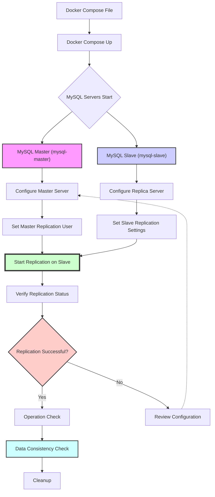

## Get your own mini MySQL backup server Up and Running (in Docker!) 🐳

> [!TIP]
> **Originally published** in [**Dev Community**](https://dev.to/siddhantkcode/how-to-set-up-a-mysql-master-slave-replication-in-docker-4n0a)

Hey there! Ever wanted to build your own mini MySQL backup server, but worried it'd be a total headache? Well, buckle up, because I'm here to show you it's actually pretty straightforward!

This guide will walk you through setting up a MySQL master and replica server using Docker Compose. Think of it like a tiny, self-contained MySQL world where your data gets mirrored – pretty cool, right?

**Why even bother?**

While some cloud platforms offer automatic backups, building your own replica server gives you a deeper understanding of how replication works. Plus, it's a fun project!

**Before we dive in, you'll need:**

- A basic understanding of MySQL (knowing your way around databases is a plus!)
- Docker installed ([https://www.docker.com/](https://www.docker.com/))
- Docker Compose installed ([https://docs.docker.com/compose/install/](https://docs.docker.com/compose/install/))

If you didn't want to setup anything and just wanted to started right away. You can click on the button below to launch the project in [Gitpod](https://www.gitpod.io).

[](https://gitpod.io/#https://github.com/Siddhant-K-code/mysql-replica-server)

## High-Level Architecture 🏗️

Here's a revised version of the mermaid diagram for the MySQL Master-Slave replication setup in a vertical layout:



### Diagram Explanation:

- **Docker Compose File**: Begin by creating and setting up the `docker-compose.yml` file.
- **Docker Compose Up**: Use Docker Compose to launch the containers.
- **MySQL Servers Start**: Represents the point where both MySQL servers (master and slave) start up.
- **MySQL Master and MySQL Slave**: These nodes split to represent configurations specific to each server.
- **Configure Master Server**: Setting up the master MySQL server with necessary configurations for replication.
- **Configure Replica Server**: Setting up the replica MySQL server according to the master's configurations.
- **Set Master Replication User**: Specific command execution on the master to facilitate replication.
- **Set Slave Replication Settings**: Slave server is set with master's log file and position details.
- **Start Replication on Slave**: The replication process is initiated on the slave server.
- **Verify Replication Status**: Checking if the replication has been set up correctly.
- **Replication Successful?**: Decision node to check if replication is successful.
- **Operation Check**: Performing operations to ensure data consistency across master and slave.
- **Data Consistency Check**: Verifying that the data on both servers are consistent.
- **Cleanup**: Bringing down the Docker containers once testing and verification are complete.
- **Review Configuration**: In case of failed replication, review and correct the configurations.

## 1. Setup Docker Compose 🛠️

Create a file named `docker-compose.yml` with the following content to define the MySQL primary (master) and replica (slave) services:

```yaml
# This line tells Docker Compose the version we're using
version: "3"

# Here's where we define our services:
services:
  # The master server, the OG in this world
  mysql-master:
    # We'll use the latest MySQL image from Docker Hub
    image: mysql:latest
    # Give it a cool name (mysql-master is pretty clear, right?)
    container_name: mysql-master
    # Extra commands to configure the master for replication
    command: --server-id=1 --log-bin=mysql-bin --binlog-format=row
    # Set some environment variables for passwords and database details
    # Remember to replace these with your own strong passwords!
    environment:
      MYSQL_ROOT_PASSWORD: your_super_secure_root_password
      MYSQL_DATABASE: mydatabase # Feel free to change this database name
      MYSQL_USER: replication_user # This user will handle replication
      MYSQL_PASSWORD: your_super_secure_replication_password
    # Map the container port (3306) to your host machine's port (also 3306)
    # This lets you access the master server from your machine
    ports:
      - "3306:3306"

  # The replica server, the master's trusty sidekick
  mysql-slave:
    # Same image as the master
    image: mysql:latest
    # Another cool name (can you guess what it is?)
    container_name: mysql-slave
    # This tells the replica to wait for the master to be ready before starting
    depends_on:
      - mysql-master
    # Similar commands and environment variables as the master
    command: --server-id=2 --log-bin=mysql-bin --binlog-format=row
    environment:
      MYSQL_ROOT_PASSWORD: your_super_secure_root_password # Same password for both
      MYSQL_DATABASE: mydatabase
      MYSQL_USER: replication_user
      MYSQL_PASSWORD: your_super_secure_replication_password
    # Map the container port (3306) to a different host machine port (3307 in this case)
    ports:
      - "3307:3306"
```

This configuration sets up two services: `mysql-master` and `mysql-slave`.

## 2. Launch Containers 🚀

Run the following command to start your containers in detached mode:

```bash
docker-compose up -d
```

## 3. Configure the Master Server 🔧

Access the master server and configure the MySQL settings:

```bash
docker exec -it mysql-master bash
mysql -uroot -p
```

Execute the following SQL commands:

```sql
ALTER USER 'replication_user'@'%' IDENTIFIED WITH 'mysql_native_password' BY 'replication_password';
GRANT REPLICATION SLAVE ON *.* TO 'replication_user'@'%';
FLUSH PRIVILEGES;
SHOW MASTER STATUS;
```

Note the log file and position from `SHOW MASTER STATUS` for later use.

## 4. Configure the Replica Server 🔧

Access the replica server:

```bash
docker exec -it mysql-slave bash
mysql -uroot -p
```

Configure the replication settings using the master log file and position:

```sql
CHANGE MASTER TO
  MASTER_HOST='mysql-master',
  MASTER_USER='replication_user',
  MASTER_PASSWORD='replication_password',
  MASTER_LOG_FILE='mysql-bin.xxxxxx',
  MASTER_LOG_POS=xxxx;
```

## 5. Start Replication on Replica Server ▶️

Initiate the replication process:

```sql
START SLAVE;
```

## 6. Verify Replication Status 🕵️‍♂️

Check the replication status to ensure everything is working correctly:

```sql
SHOW SLAVE STATUS\G
```

Confirm that `Slave_IO_Running` and `Slave_SQL_Running` show as "Yes".

## 7. Operation Check ✔️

Perform a simple data replication test to confirm the setup:

1. **On the master server**:
   ```sql
   use mydatabase;
   create table user (id int);
   insert into user values (1);
   select * from user;
   ```
2. **On the replica server**:
   ```sql
   use mydatabase;
   select * from user;
   ```

Ensure the data is consistent across both servers.

## Cleanup 🧹

When done, you can bring down the Docker containers with:

```bash
docker-compose down
```

## Conclusion 🎉

While cloud providers offer one-click solutions for database replication, setting it up manually provides valuable insights into the operational mechanics. This setup is straightforward but consider advanced features like failover and storage distribution for production environments.
